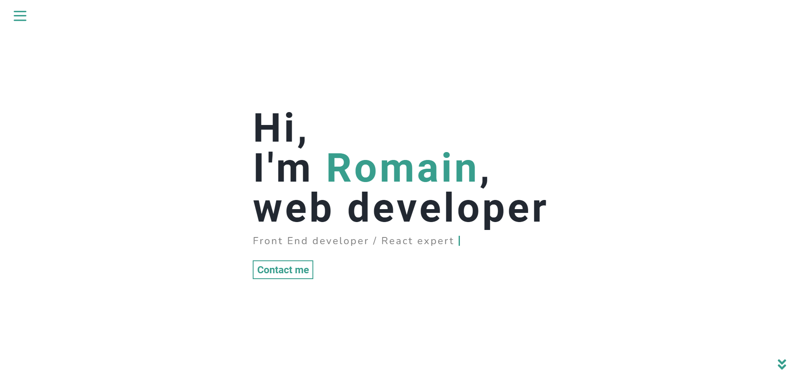

# Portfolio

An eficient way to present my self and my projects, feel free to customise it and use it for your self.

## Table of contents

- [Overview](#overview)
  - [Screenshot](#screenshot)
  - [Links](#links)
- [My process](#my-process)
  - [Built with](#built-with)
- [Author](#author)

## Overview

### The project

My personal portfolio web site, designed to present my projects.

### Screenshot

### Links

- Live Site URL: [Add live site URL here](https://romain-accoce-portfolio.surge.sh/)

## My process

### Built with

- Semantic HTML5 markup
- CSS custom properties
- Flexbox
- Javascript
- [React](https://reactjs.org/) - JS library
- [REACT REDUX](https://react-redux.js.org/) - React library
- [Sass](https://sass-lang.com/) - For styles

## Author

- Website - [Romain Accoce](https://romain-accoce-portfolio.surge.sh/)
- LinkedIn - [@romain-accoce](https://www.linkedin.com/in/romain-accoce/)
- Twitter - [@romanocrew](https://twitter.com/romanocrew/)
